# Vehicle Identification for Law Enforcement
## ECE228 - Team 7
- Hung-Te Cheng, h5cheng@ucsd.edu
- Juo-Yun Chen ,  juc025@ucsd.edu 

## Dataset
Cars dataset by Janathan Krause[1]
- total 16,185 images
- cars_annos.mat

## Models
- Data preprocessing
  - ClassGenerator.ipynb
    - Generate classes.names (deprecate, for yolov4)
  - XMLGenerator.ipynb
    - Generate XML format annotation from mat format
  - XML2YOLO.ipynb
    - Generate YOLOv4 format annotation from XML format (deprecate)
  - XML2PytorchYOLO.ipynb
    - Generate YOLOv5 format annotation
  - TrainTestSplit.ipynb
    - Spliting dataset and copy into desired folder
- YOLOv5
  - yolov5 by ultralytics

## Implementation
### Train yolov5 (under yolov5 folder)
#### Baseline training
```shell
python train.py --img 416 --batch 32 --epochs 300 --data <custom<50/60/70/80>.yaml> 
--weights yolov5s.pt --device 0 --workers 0 --save-period 50 --name <train_<50/60/70/80>>
```
#### Mixup
```shell
python train.py --img 416 --batch 32 --epochs 300 --data <custom<50/60/70/80>.yaml> 
--weights yolov5s.pt --device 0 --workers 0 --save-period 50 --name <train_<50/60/70/80>_mixup>
--hyp hyp_custom_mixup.yaml
```

#### Adam
```shell
python train.py --img 416 --batch 32 --epochs 300 --data <custom<50/60/70/80>.yaml> 
--weights yolov5s.pt --device 0 --workers 0 --save-period 50 --name <train_<50/60/70/80>_Adam> 
--optimizer Adam
```

## Training images

### Mosaic
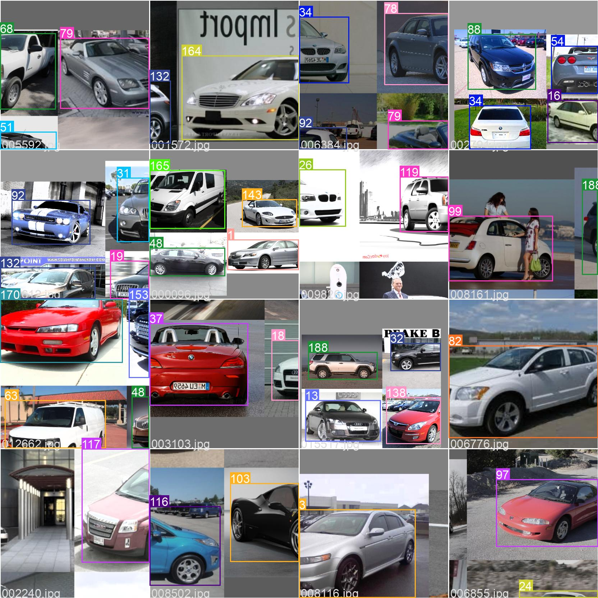

### Mixup
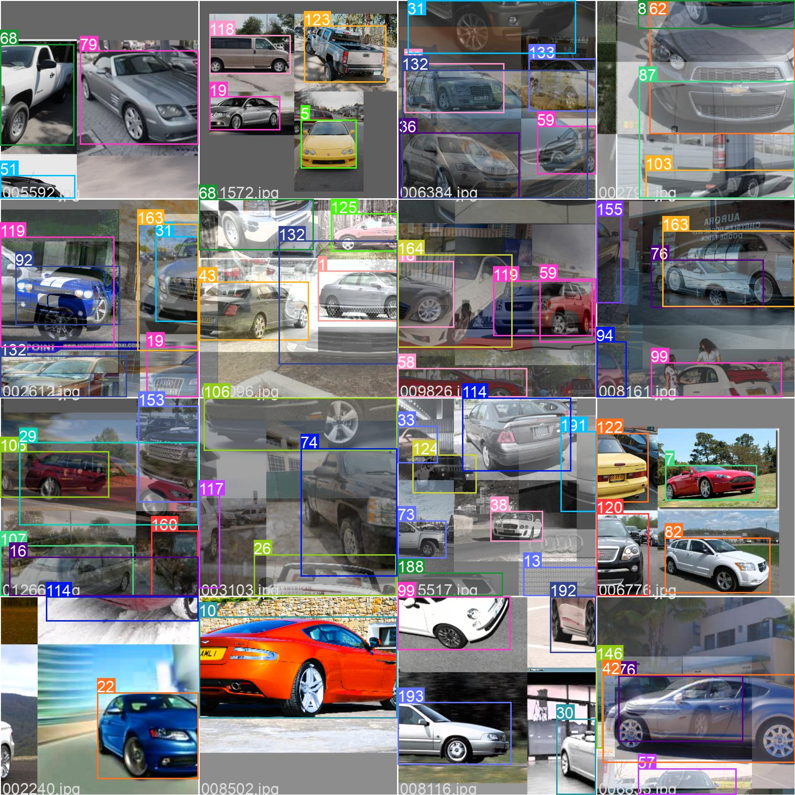

## Results
### Tensorboard
[Tensorboard.dev](https://tensorboard.dev/experiment/Say2oRrHRGmTJtQyOeSbCw/#scalars)

### Prediction
#### Ground Truth
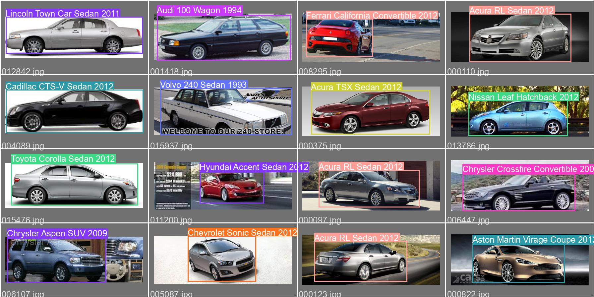

#### Prediction
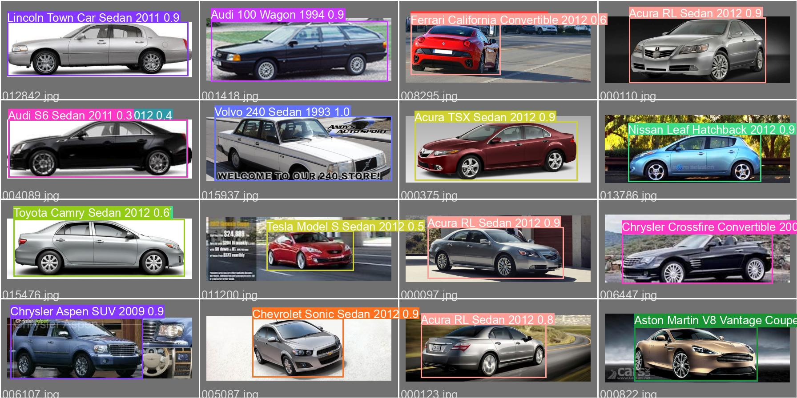

### F1 Curve
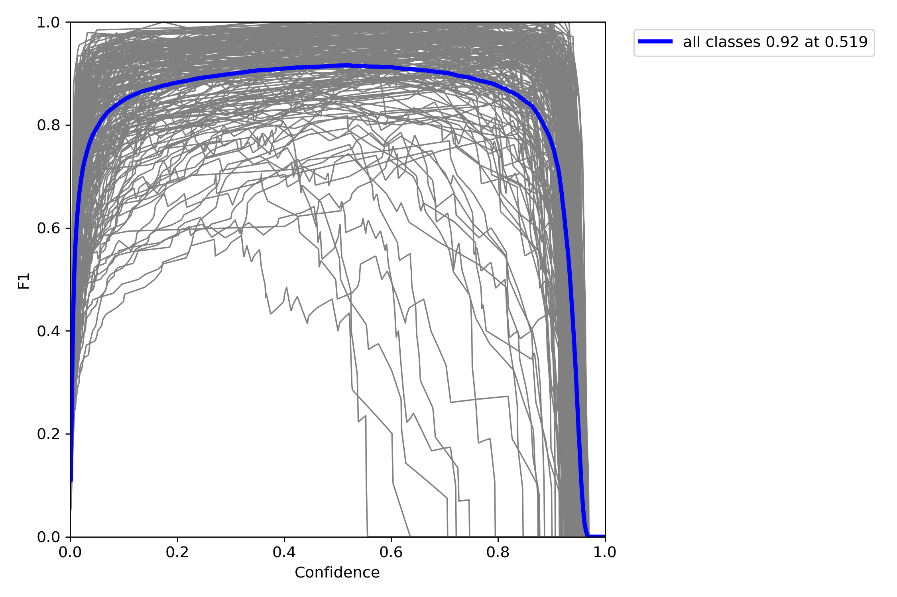

### PR Curve
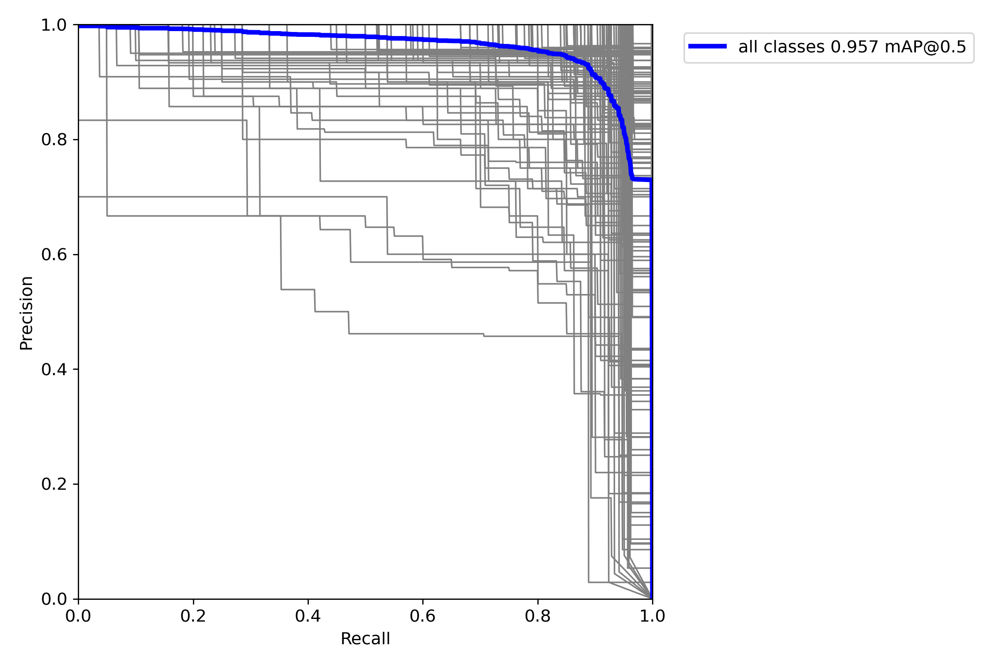

## Loss and Metrics
### train/box_loss
Mosaic             |  Mosaic + Mixup
:-----------------:|:-----------------:
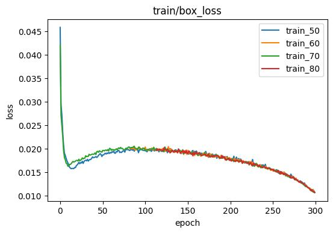  |  

### train/obj_loss
Mosaic             |  Mosaic + Mixup
:-----------------:|:-----------------:
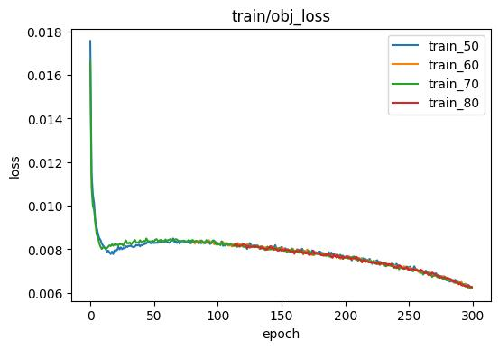  |  

### train/cls_loss
Mosaic             |  Mosaic + Mixup
:-----------------:|:-----------------:
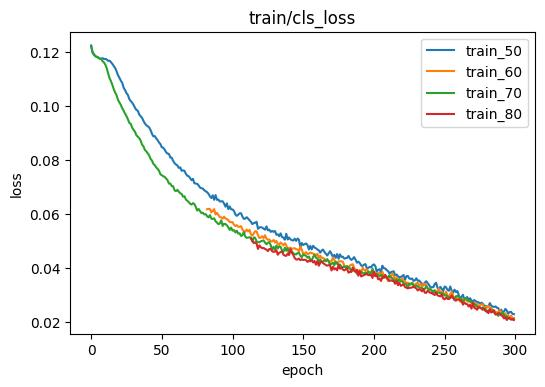  |  

### val/box_loss
Mosaic             |  Mosaic + Mixup
:-----------------:|:-----------------:
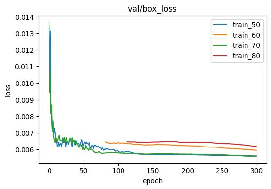  |  

### val/obj_loss
Mosaic             |  Mosaic + Mixup
:-----------------:|:-----------------:
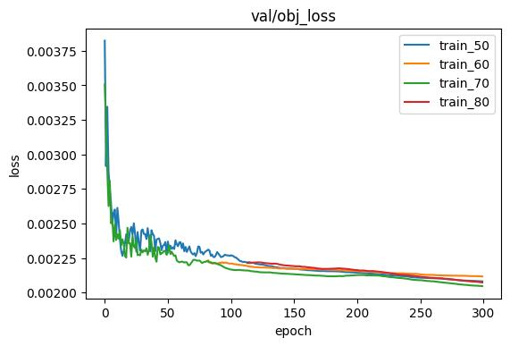  |  

### val/cls_loss
Mosaic             |  Mosaic + Mixup
:-----------------:|:-----------------:
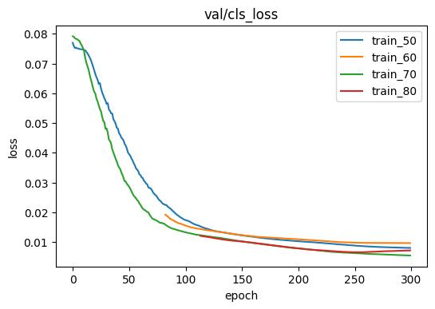  |  

### metric/precision
Mosaic             |  Mosaic + Mixup
:-----------------:|:-----------------:
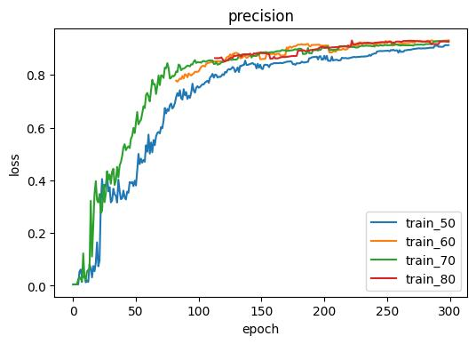  |  

### metric/recall
Mosaic             |  Mosaic + Mixup
:-----------------:|:-----------------:
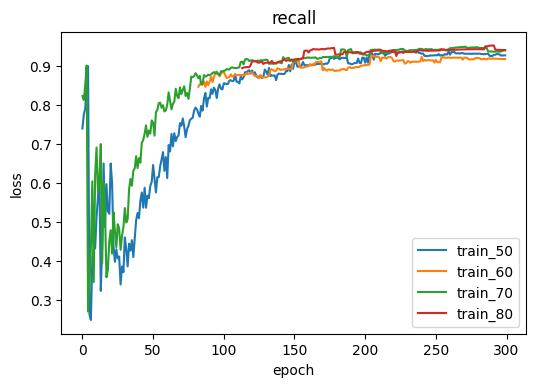  |  

### metric/mAP_0.5
Mosaic             |  Mosaic + Mixup
:-----------------:|:-----------------:
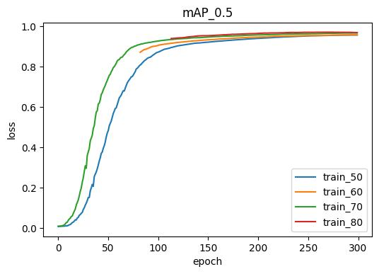  |  

### metric/mAP_0.5:0.95
Mosaic             |  Mosaic + Mixup
:-----------------:|:-----------------:
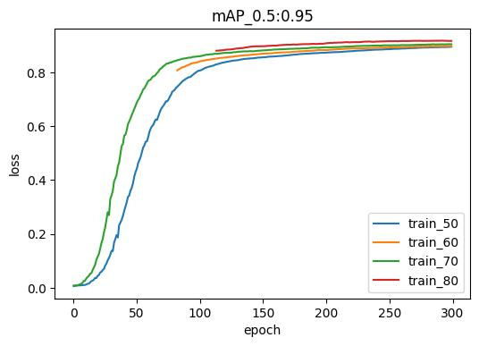  |  

## Conclusion
The data augmentation method Mosaic proposed in Yolov4 strongly increased the prediction accuracy. We can see that with different size of training set (50% / 60% / 70% / 80%), all result in around 90% of accuracy. Also, in this task, the accuracy is good enough since we're aiming to classify a car's **model and year** rather than the **exact posistion** of a car. And all these result has only around 2% difference in accuracy.  

For Mosaic + Mixup, the accuracy is pretty close to Mosaic.

In conclusion, we can use a small dataset with Mosaic to get a good prediction result, it only takes around 3-5 days to reach 90% of accuracy.

## Future Work
- Collect data for newer model since the current dataset only contains old car (e.g. 2012 Ford)
- Demo the result by pretrained model with a CCTV-like image or video

## Reference
1. [Car dataset by Jonathan Krause](https://ai.stanford.edu/~jkrause/cars/car_dataset.html)
2. [Yolov5 by ultralytics](https://github.com/ultralytics/yolov5)
