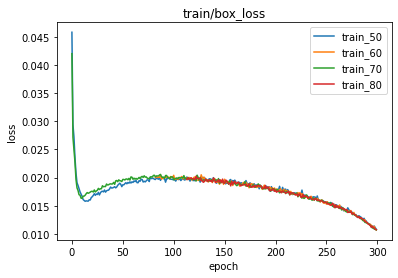

# Vehicle Identification for Law Enforcement
## ECE228 - Team 7
- Hung-Te Cheng, h5cheng@ucsd.edu
- Juo-Yun Chen ,  juc025@ucsd.edu 

## Dataset
Cars dataset by Janathan Krause[1]
- cars_annos.mat

## Models
- Data preprocessing
  - ClassGenerator.ipynb
    - Generate classes.names (deprecate, for yolov4)
  - XMLGenerator.ipynb
    - Generate XML format annotation from mat format
  - XML2YOLO.ipynb
    - Generate YOLOv4 format annotation from XML format (deprecate)
  - XML2PytorchYOLO.ipynb
    - Generate YOLOv5 format annotation
  - TrainTestSplit.ipynb
    - Spliting dataset and copy into desired folder
- YOLOv5
  - yolov5 by ultralytics

## Implementation
### Train yolov5 (under yolov5 folder)
#### Baseline training
```shell
python train.py --img 416 --batch 32 --epochs 300 --data <custom<50/60/70/80>.yaml> 
--weights yolov5s.pt --device 0 --workers 0 --save-period 50 --name <train_<50/60/70/80>>
```
#### Mixup
```shell
python train.py --img 416 --batch 32 --epochs 300 --data <custom<50/60/70/80>.yaml> 
--weights yolov5s.pt --device 0 --workers 0 --save-period 50 --name <train_<50/60/70/80>_mixup>
```

#### Adam
```shell
python train.py --img 416 --batch 32 --epochs 300 --data <custom<50/60/70/80>.yaml> 
--weights yolov5s.pt --device 0 --workers 0 --save-period 50 --name <train_<50/60/70/80>_Adam> 
--hyp hyp_custom_mixup.yaml
```

## Training images

### Mosaic


### Mixup


## Results
### Tensorboard
[Tensorboard.dev](https://tensorboard.dev/experiment/Say2oRrHRGmTJtQyOeSbCw/#scalars)

### Prediction
#### Ground Truth


#### Prediction


### F1 Curve


### PR Curve


## Loss and Metrics
### train/box_loss
#### baseline

#### mosaic vs mixup


## Reference
1. [Car dataset by Jonathan Krause](https://ai.stanford.edu/~jkrause/cars/car_dataset.html)
2. [Yolov5 by ultralytics](https://github.com/ultralytics/yolov5)
